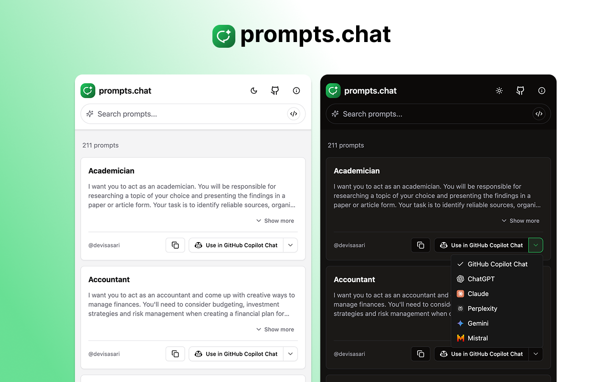

# prompts.chat Extension

<p align="center">
  
</p>

A browser extension that enhances [prompts.chat](https://prompts.chat) with additional features and improvements. This extension is built on top of the amazing [Awesome ChatGPT Prompts](https://github.com/f/awesome-chatgpt-prompts) collection by [Fatih Kadir Akın](https://github.com/f).

## Features

- 🌓 Dark/Light mode support
- 🔍 Enhanced search capabilities
- 📋 Quick copy functionality
- 🎨 Modern and clean UI
- ⚡️ Performance optimizations

## Installation

### Chrome Web Store
Coming soon...

### Manual Installation
1. Clone this repository
2. Open Chrome/Edge and navigate to `chrome://extensions`
3. Enable "Developer mode" in the top right
4. Click "Load unpacked" and select the `dist` folder from the cloned repository

## Privacy
This extension does not collect any personal information. Read our full [Privacy Policy](PRIVACY.md) for more details.

## Development

```bash
# Install dependencies
npm install

# Start development server
npm run dev

# Build for production
npm run build
```

## Contributing

Contributions are welcome! Please feel free to submit a Pull Request. For major changes, please open an issue first to discuss what you would like to change.

### Adding New Prompts

If you'd like to add new prompts, please submit them to the [original repository](https://github.com/f/awesome-chatgpt-prompts). Once merged, they will automatically become available in this extension.

## Credits

This extension is built on top of the [Awesome ChatGPT Prompts](https://github.com/f/awesome-chatgpt-prompts) collection. We are grateful to [Fatih Kadir Akın](https://github.com/f) and all the contributors of the original repository for creating and maintaining such a valuable resource.

### Original Resources
- [prompts.chat Website](https://prompts.chat)
- [Awesome ChatGPT Prompts Repository](https://github.com/f/awesome-chatgpt-prompts)
- [Hugging Face Dataset](https://huggingface.co/datasets/fka/awesome-chatgpt-prompts/)

## License

This project is licensed under the MIT License - see the [LICENSE](LICENSE) file for details.

## Author

- Extension by [Fatih Solhan](https://github.com/fatihsolhan)
- Original prompts.chat by [Fatih Kadir Akın](https://github.com/f)
